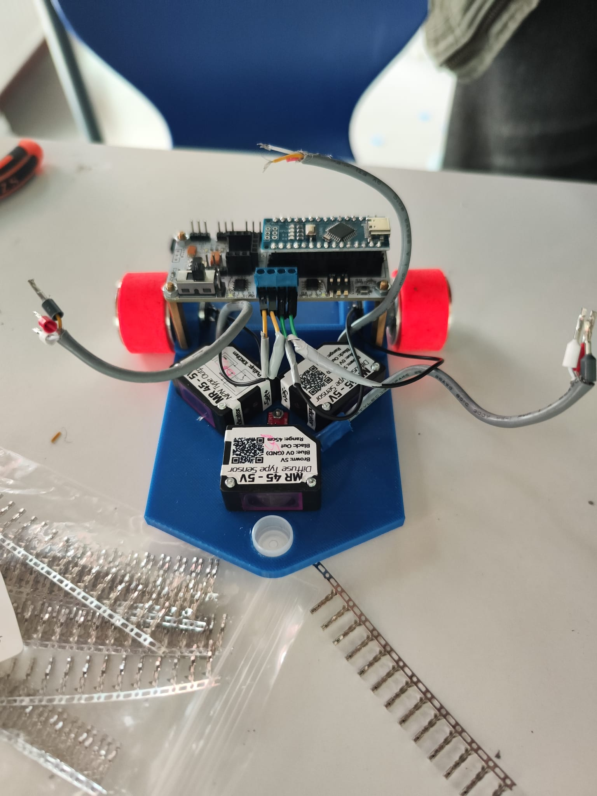

# meb-robot
Retrospective documentation of a Maze Solver robot made for MEB ROBO 2025 &amp; 2026

This is a compact, autonomous maze solver robot. Made with a 3d printed chassis and IR sensors; was designed and iterated over the span of 2 years to optimize turning and wall following ability.

 * Microcontroller: Arduino Nano
 * Sensors: 3x MR 45-5V Diffuse Sensors
 * Custom 3D printed PETG
 * Logic: Wall following (Left side)
   
[Watch the video](https://youtu.be/hQ72KUeb8lM)

# Engineering Decisions
Optimized sensor array for navigation:
 * used 3 point diffuse sensor array (45 degree angle to each side)
 * the 45 degree angle allows the sensors to detect the wall earlier allowing for smoother velocity transitions and preventing stuttering in logic

Finish detection:
 * used a compact QTR type IR sensor that faces the ground with a small mounting point in an accessible location in the middle of the chassis
 * this allows for a digital output signal showing whether the color of the ground is reflective or not (Effectively black/white) and thus allows me to find the differently colored finish grid

Inverted motor mount:
 * I mounted the motors on the top side of the chassis plate rather than the bottom
 * This lowers the entire chassis to the ground, lower CoM reduces the moment of inertia in high speed turns, massively decreasing the force that tips the robot/prevents it from losing traction

# Mentorship & Leadership
After a relatively succesful 2025 season with 10 students (5 teams), there were a lot of interested students. I co-led the technical mentorship for 8 incoming Preparatory and 9th grade students
I translated my 2025 and 2026 experience into a 'base model' (this repo) and i hope to enable new students and current participants to move past basic assembly and focus on more advanced logic and troubleshooting

 * Design and manufacturing: I handled the full CAD to print cycle, ensuring every team had a structurally sound chassis
 * Component Integration: I pre-selected the sensor array and motor positions to eliminate hardware level issues, allowing the students to focus on logic
 * Technical Direction: I gave them a guide to follow for connecting electronics components for optimal IO and logic management

By abstracting mechanical complexity I allowed the 8 junior students to engage directly with logic; turning raw signals into autonomous behavior through their own code.

# 2025-2026 Iteration Comparison
In the 2025 version, the motors were at the bottom of the plate which not only meant the robot would be really high off the ground compared to other robots but also meant that because the caster wheel was shorter than the height of the chassis plate from the ground, it made the entire robot stand on a 15 degree angle which ruined the sensors' output becasue the sensors were effectively looking at the ground instead of forward
